lab07
================

# K Means Clustering

``` r
tmp <- c(rnorm(30,-3),rnorm(30,3) )
hist(tmp)
```

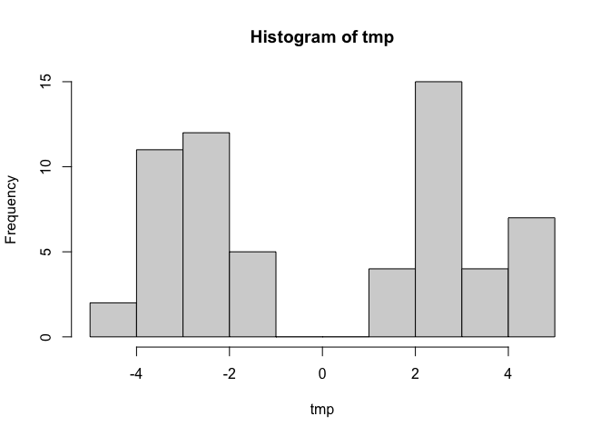

``` r
x <- data.frame(x=tmp,y=rev(tmp))
plot(x)
```

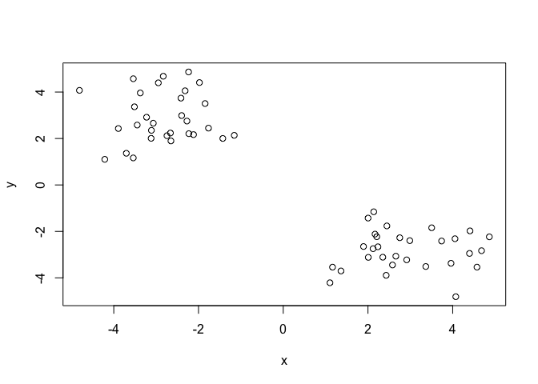

``` r
km <- kmeans(x, centers=2)
km$cluster
```

     [1] 1 1 1 1 1 1 1 1 1 1 1 1 1 1 1 1 1 1 1 1 1 1 1 1 1 1 1 1 1 1 2 2 2 2 2 2 2 2
    [39] 2 2 2 2 2 2 2 2 2 2 2 2 2 2 2 2 2 2 2 2 2 2

``` r
plot(x,col=km$cluster+1)
```

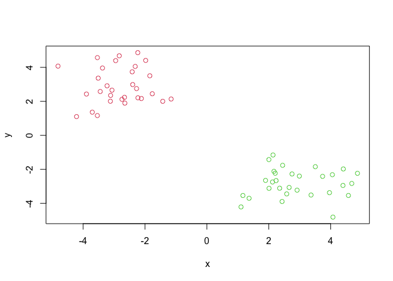

``` r
library(ggplot2)
ggplot(x) +
  aes(x,y) +
  geom_point(col=km$cluster)
```

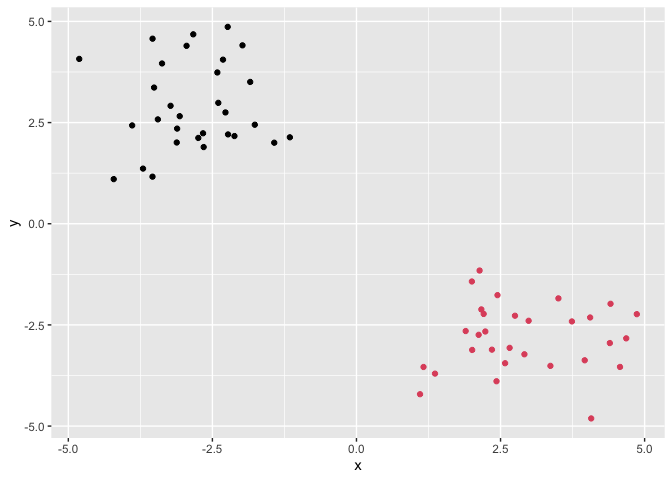

``` r
mycols <- rep("grey",60)
mycols[km$cluster==1] <- "green"
mycols[c(10,12,20)] <- "red"
plot(x,col=mycols)
```

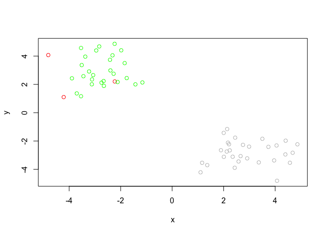

``` r
totss <- NULL
k <- 1:7
for (i in k){
  km <- kmeans(x,centers=i)
  #totss[i] <- km$tot.withinss
  totss <- c(totss,km$tot.withinss)
}
totss
```

    [1] 1091.15171  108.68726   81.77267   72.44102   68.63967   65.98974   33.88882

``` r
plot(totss,type="o")
```

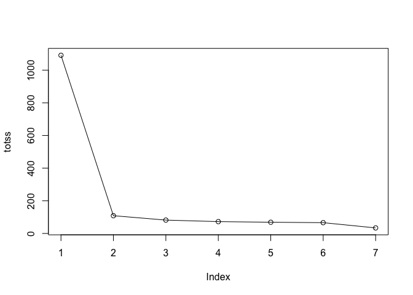

``` r
totss <- rep(NaN,7)
k <- 1:7
for (i in k){
  totss[i] <- kmeans(x,centers=i)$tot.withinss
  #totss <- c(totss,km$tot.withinss)
}
totss
```

    [1] 1091.15171  108.68726   81.77267   54.85807   45.52642   66.96736   38.23731

# Hierarchical Clunstering

``` r
d <- dist(x)
hc <- hclust(d)
plot(hc)
```

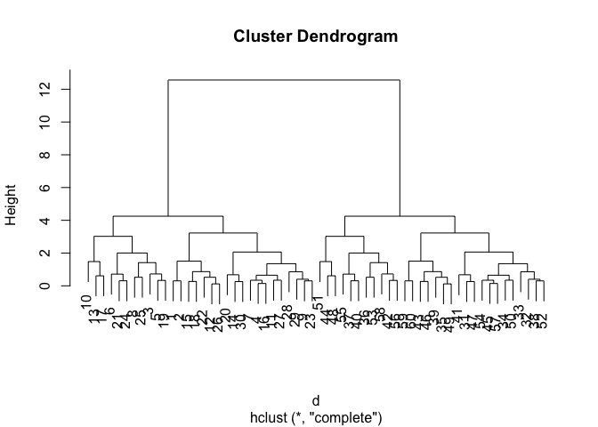

``` r
cutree(hc,h=10)
```

     [1] 1 1 1 1 1 1 1 1 1 1 1 1 1 1 1 1 1 1 1 1 1 1 1 1 1 1 1 1 1 1 2 2 2 2 2 2 2 2
    [39] 2 2 2 2 2 2 2 2 2 2 2 2 2 2 2 2 2 2 2 2 2 2

``` r
grps <- cutree(hc,k=2)
```

``` r
ggplot(x) +
  aes(x,y) +
  geom_point(col=grps)
```


# PCA

``` r
url <- "https://tinyurl.com/UK-foods"
x <- read.csv(url,row.names=1)
head(x)
```

                   England Wales Scotland N.Ireland
    Cheese             105   103      103        66
    Carcass_meat       245   227      242       267
    Other_meat         685   803      750       586
    Fish               147   160      122        93
    Fats_and_oils      193   235      184       209
    Sugars             156   175      147       139

``` r
pairs(x, col=rainbow(10), pch=16)
```

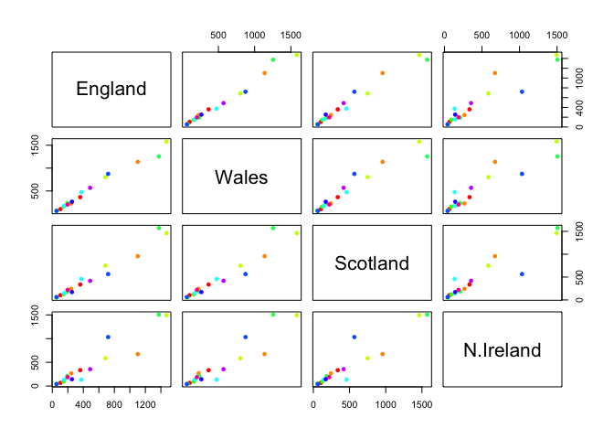

``` r
barplot(as.matrix(x), beside=F, col=rainbow(nrow(x)))
```


``` r
pca <- prcomp( t(x) )
summary(pca)$importance
```

                                 PC1       PC2      PC3          PC4
    Standard deviation     324.15019 212.74780 73.87622 4.188568e-14
    Proportion of Variance   0.67444   0.29052  0.03503 0.000000e+00
    Cumulative Proportion    0.67444   0.96497  1.00000 1.000000e+00

``` r
pca$x[,"PC1"]
```

       England      Wales   Scotland  N.Ireland 
    -144.99315 -240.52915  -91.86934  477.39164 

``` r
plot(pca$x[,"PC1"], pca$x[,"PC2"], xlab="PC1", ylab="PC2", xlim=c(-270,500), col=c(1:4),cex=2)
text(pca$x[,1], pca$x[,2], colnames(x),col=c(1:4))
```

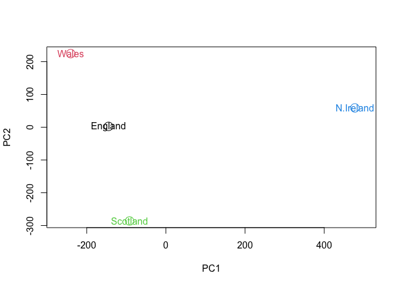

``` r
v <- round( pca$sdev^2/sum(pca$sdev^2) * 100 )
barplot(v, xlab="Principal Component", ylab="Percent Variation")
```

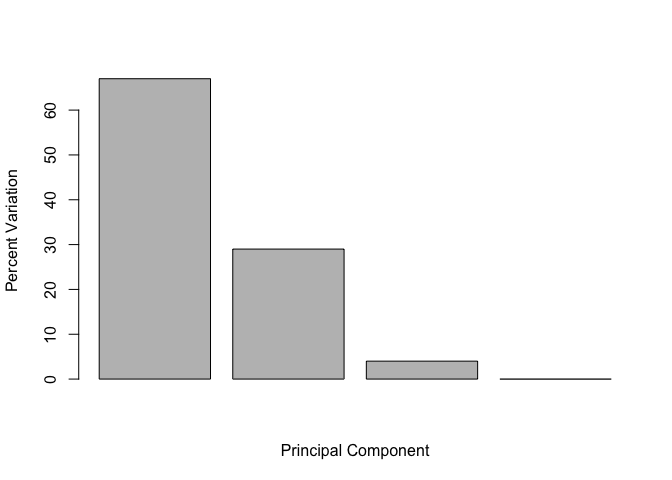

``` r
## Lets focus on PC1 as it accounts for > 90% of variance 
par(mar=c(10, 3, 0.35, 0))
barplot( pca$rotation[,1], las=2 )
```


``` r
pca$rotation
```

                                 PC1          PC2         PC3          PC4
    Cheese              -0.056955380 -0.016012850 -0.02394295 -0.691718038
    Carcass_meat         0.047927628 -0.013915823 -0.06367111  0.635384915
    Other_meat          -0.258916658  0.015331138  0.55384854  0.198175921
    Fish                -0.084414983  0.050754947 -0.03906481 -0.015824630
    Fats_and_oils       -0.005193623  0.095388656  0.12522257  0.052347444
    Sugars              -0.037620983  0.043021699  0.03605745  0.014481347
    Fresh_potatoes       0.401402060  0.715017078  0.20668248 -0.151706089
    Fresh_Veg           -0.151849942  0.144900268 -0.21382237  0.056182433
    Other_Veg           -0.243593729  0.225450923  0.05332841 -0.080722623
    Processed_potatoes  -0.026886233 -0.042850761  0.07364902 -0.022618707
    Processed_Veg       -0.036488269  0.045451802 -0.05289191  0.009235001
    Fresh_fruit         -0.632640898  0.177740743 -0.40012865 -0.021899087
    Cereals             -0.047702858  0.212599678  0.35884921  0.084667257
    Beverages           -0.026187756  0.030560542  0.04135860 -0.011880823
    Soft_drinks          0.232244140 -0.555124311  0.16942648 -0.144367046
    Alcoholic_drinks    -0.463968168 -0.113536523  0.49858320 -0.115797605
    Confectionery       -0.029650201 -0.005949921  0.05232164 -0.003695024

``` r
pca$x[]
```

                     PC1         PC2         PC3           PC4
    England   -144.99315    2.532999 -105.768945  2.842865e-14
    Wales     -240.52915  224.646925   56.475555  7.804382e-13
    Scotland   -91.86934 -286.081786   44.415495 -9.614462e-13
    N.Ireland  477.39164   58.901862    4.877895  1.448078e-13

``` r
ggplot(as.data.frame(pca$rotation)) +
  aes(pca$rotation[,1],rownames(pca$rotation)) +
  geom_col()
```

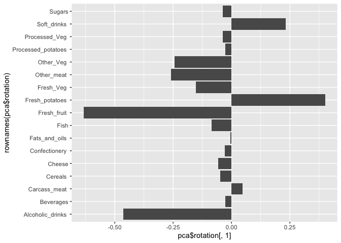
