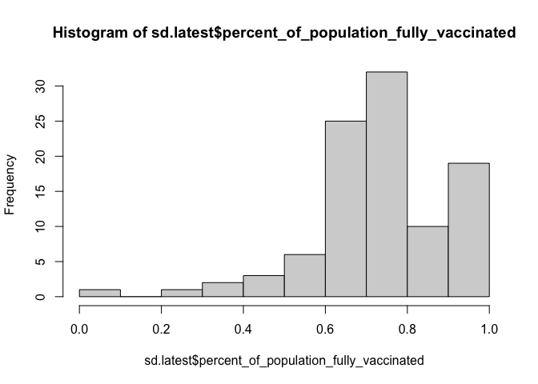
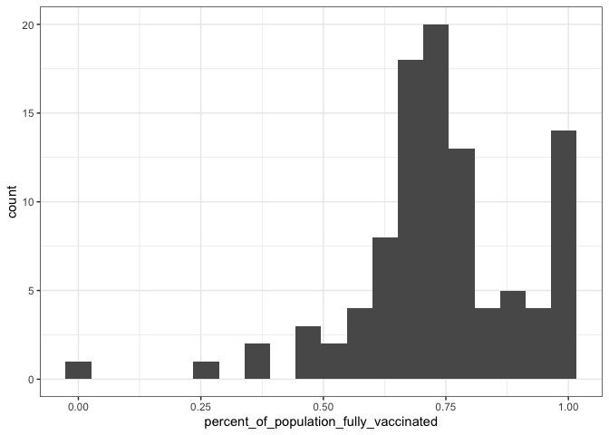
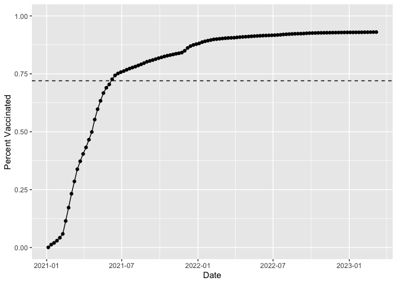
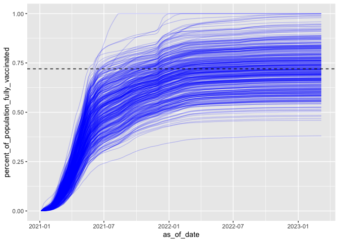

lab17
================
Eva

## Data Input

# Background

``` r
vax <- read.csv("covid19vaccinesbyzipcode_test.csv")
#head(vax)
```

# Quick EDA

``` r
vax$as_of_date[1]
```

    [1] "2021-01-05"

``` r
tail(vax$as_of_date,n=1)
```

    [1] "2023-03-07"

``` r
# unique(vax$as_of_date)
```

``` r
skimr::skim(vax)
```

|                                                  |        |
|:-------------------------------------------------|:-------|
| Name                                             | vax    |
| Number of rows                                   | 201096 |
| Number of columns                                | 18     |
| \_\_\_\_\_\_\_\_\_\_\_\_\_\_\_\_\_\_\_\_\_\_\_   |        |
| Column type frequency:                           |        |
| character                                        | 5      |
| numeric                                          | 13     |
| \_\_\_\_\_\_\_\_\_\_\_\_\_\_\_\_\_\_\_\_\_\_\_\_ |        |
| Group variables                                  | None   |

Data summary

**Variable type: character**

| skim_variable             | n_missing | complete_rate | min | max | empty | n_unique | whitespace |
|:--------------------------|----------:|--------------:|----:|----:|------:|---------:|-----------:|
| as_of_date                |         0 |             1 |  10 |  10 |     0 |      114 |          0 |
| local_health_jurisdiction |         0 |             1 |   0 |  15 |   570 |       62 |          0 |
| county                    |         0 |             1 |   0 |  15 |   570 |       59 |          0 |
| vem_source                |         0 |             1 |  15 |  26 |     0 |        3 |          0 |
| redacted                  |         0 |             1 |   2 |  69 |     0 |        2 |          0 |

**Variable type: numeric**

| skim_variable                              | n_missing | complete_rate |     mean |       sd |    p0 |      p25 |      p50 |      p75 |     p100 | hist  |
|:-------------------------------------------|----------:|--------------:|---------:|---------:|------:|---------:|---------:|---------:|---------:|:------|
| zip_code_tabulation_area                   |         0 |          1.00 | 93665.11 |  1817.38 | 90001 | 92257.75 | 93658.50 | 95380.50 |  97635.0 | ▃▅▅▇▁ |
| vaccine_equity_metric_quartile             |      9918 |          0.95 |     2.44 |     1.11 |     1 |     1.00 |     2.00 |     3.00 |      4.0 | ▇▇▁▇▇ |
| age12_plus_population                      |         0 |          1.00 | 18895.04 | 18993.87 |     0 |  1346.95 | 13685.10 | 31756.12 |  88556.7 | ▇▃▂▁▁ |
| age5_plus_population                       |         0 |          1.00 | 20875.24 | 21105.97 |     0 |  1460.50 | 15364.00 | 34877.00 | 101902.0 | ▇▃▂▁▁ |
| tot_population                             |      9804 |          0.95 | 23372.77 | 22628.50 |    12 |  2126.00 | 18714.00 | 38168.00 | 111165.0 | ▇▅▂▁▁ |
| persons_fully_vaccinated                   |     16621 |          0.92 | 13990.39 | 15073.66 |    11 |   932.00 |  8589.00 | 23346.00 |  87575.0 | ▇▃▁▁▁ |
| persons_partially_vaccinated               |     16621 |          0.92 |  1702.31 |  2033.32 |    11 |   165.00 |  1197.00 |  2536.00 |  39973.0 | ▇▁▁▁▁ |
| percent_of_population_fully_vaccinated     |     20965 |          0.90 |     0.57 |     0.25 |     0 |     0.42 |     0.61 |     0.74 |      1.0 | ▂▃▆▇▃ |
| percent_of_population_partially_vaccinated |     20965 |          0.90 |     0.08 |     0.09 |     0 |     0.05 |     0.06 |     0.08 |      1.0 | ▇▁▁▁▁ |
| percent_of_population_with_1\_plus_dose    |     22009 |          0.89 |     0.63 |     0.24 |     0 |     0.49 |     0.67 |     0.81 |      1.0 | ▂▂▅▇▆ |
| booster_recip_count                        |     72997 |          0.64 |  5882.76 |  7219.00 |    11 |   300.00 |  2773.00 |  9510.00 |  59593.0 | ▇▂▁▁▁ |
| bivalent_dose_recip_count                  |    158776 |          0.21 |  2978.23 |  3633.03 |    11 |   193.00 |  1467.50 |  4730.25 |  27694.0 | ▇▂▁▁▁ |
| eligible_recipient_count                   |         0 |          1.00 | 12830.83 | 14928.64 |     0 |   507.00 |  6369.00 | 22014.00 |  87248.0 | ▇▃▁▁▁ |

``` r
n_missing <- sum(is.na(vax$persons_fully_vaccinated))
percent_n_missing <- round(n_missing/nrow(vax)*100,2)
percent_n_missing
```

    [1] 8.27

``` r
library(lubridate)
today()-ymd(vax$as_of_date[1])
```

    Time difference of 801 days

``` r
today()-ymd("1997-03-23")
```

    Time difference of 9490 days

``` r
today()-ymd("2021-11-23")
```

    Time difference of 479 days

``` r
vax$as_of_date <- ymd(vax$as_of_date)
today() - vax$as_of_date[nrow(vax)]
```

    Time difference of 10 days

``` r
library(dplyr)
```


    Attaching package: 'dplyr'

    The following objects are masked from 'package:stats':

        filter, lag

    The following objects are masked from 'package:base':

        intersect, setdiff, setequal, union

``` r
n_distinct(vax$as_of_date)
```

    [1] 114

``` r
library(zipcodeR)
geocode_zip('92037')
```

    # A tibble: 1 × 3
      zipcode   lat   lng
      <chr>   <dbl> <dbl>
    1 92037    32.8 -117.

``` r
reverse_zipcode(c('92037', "92109") )
```

    # A tibble: 2 × 24
      zipcode zipcode_…¹ major…² post_…³ common_c…⁴ county state   lat   lng timez…⁵
      <chr>   <chr>      <chr>   <chr>       <blob> <chr>  <chr> <dbl> <dbl> <chr>  
    1 92037   Standard   La Jol… La Jol… <raw 20 B> San D… CA     32.8 -117. Pacific
    2 92109   Standard   San Di… San Di… <raw 21 B> San D… CA     32.8 -117. Pacific
    # … with 14 more variables: radius_in_miles <dbl>, area_code_list <blob>,
    #   population <int>, population_density <dbl>, land_area_in_sqmi <dbl>,
    #   water_area_in_sqmi <dbl>, housing_units <int>,
    #   occupied_housing_units <int>, median_home_value <int>,
    #   median_household_income <int>, bounds_west <dbl>, bounds_east <dbl>,
    #   bounds_north <dbl>, bounds_south <dbl>, and abbreviated variable names
    #   ¹​zipcode_type, ²​major_city, ³​post_office_city, ⁴​common_city_list, …

``` r
sd_zip <- unique(vax$zip_code_tabulation_area[vax$county == "San Diego"])
sd_eco <- reverse_zipcode(sd_zip)
sd_eco
```

    # A tibble: 107 × 24
       zipcode zipcode…¹ major…² post_…³ common_c…⁴ county state   lat   lng timez…⁵
       <chr>   <chr>     <chr>   <chr>       <blob> <chr>  <chr> <dbl> <dbl> <chr>  
     1 91901   Standard  Alpine  Alpine… <raw 18 B> San D… CA     32.8 -117. Pacific
     2 91902   Standard  Bonita  Bonita… <raw 18 B> San D… CA     32.7 -117. Pacific
     3 91905   Standard  Boulev… Boulev… <raw 21 B> San D… CA     32.7 -116. Pacific
     4 91906   Standard  Campo   Campo,… <raw 17 B> San D… CA     32.7 -116. Pacific
     5 91910   Standard  Chula … Chula … <raw 23 B> San D… CA     32.6 -117. Pacific
     6 91911   Standard  Chula … Chula … <raw 23 B> San D… CA     32.6 -117. Pacific
     7 91913   Standard  Chula … Chula … <raw 23 B> San D… CA     32.6 -117. Pacific
     8 91914   Standard  Chula … Chula … <raw 23 B> San D… CA     32.7 -117. Pacific
     9 91915   Standard  Chula … Chula … <raw 23 B> San D… CA     32.6 -117. Pacific
    10 91916   Standard  Descan… Descan… <raw 20 B> San D… CA     32.9 -117. Pacific
    # … with 97 more rows, 14 more variables: radius_in_miles <dbl>,
    #   area_code_list <blob>, population <int>, population_density <dbl>,
    #   land_area_in_sqmi <dbl>, water_area_in_sqmi <dbl>, housing_units <int>,
    #   occupied_housing_units <int>, median_home_value <int>,
    #   median_household_income <int>, bounds_west <dbl>, bounds_east <dbl>,
    #   bounds_north <dbl>, bounds_south <dbl>, and abbreviated variable names
    #   ¹​zipcode_type, ²​major_city, ³​post_office_city, ⁴​common_city_list, …

``` r
ord <- order(sd_eco$median_household_income)
sd_eco[ord,]$median_household_income
```

      [1]  24426  27675  36621  37143  37534  37987  38021  38563  40539  40557
     [11]  41607  41866  45983  46580  46856  46875  47559  47947  48111  49268
     [21]  49521  49521  49534  50750  51158  51542  51694  52242  52550  53167
     [31]  53448  53843  54056  54441  54448  55839  55938  56310  57350  57618
     [41]  58079  59719  59849  60313  60929  61067  62092  63098  63449  64004
     [51]  64026  64033  64044  64478  64926  65869  65871  67616  69601  69678
     [61]  69821  70264  71100  71412  71628  72206  73333  76273  79792  80463
     [71]  81000  81505  81835  82075  84299  86406  86981  87701  90417  90960
     [81]  91103  92531  93750  94665  96153  99367  99412 100100 103393 104063
     [91] 107870 114880 120106 124099 125051 127968 131406 226875     NA     NA
    [101]     NA     NA     NA     NA     NA     NA     NA

``` r
library(dplyr)
sd <- filter(vax, county == "San Diego")

sd.10 <- filter(vax, county == "San Diego" &
                age5_plus_population > 10000)
```

``` r
sd.latest <- filter(sd, as_of_date == "2023-03-07")
mean(sd.latest$percent_of_population_fully_vaccinated,na.rm=T)
```

    [1] 0.7402567

``` r
hist(sd.latest$percent_of_population_fully_vaccinated)
```



``` r
library(ggplot2)
ggplot(sd.latest, aes(x=percent_of_population_fully_vaccinated)) + geom_histogram(bins=20) +
  theme_bw() + xlab("percent_of_population_fully_vaccinated")
```

    Warning: Removed 8 rows containing non-finite values (`stat_bin()`).



``` r
ucsd <- filter(sd, zip_code_tabulation_area=="92037")
head(ucsd)
```

      as_of_date zip_code_tabulation_area local_health_jurisdiction    county
    1 2021-01-05                    92037                 San Diego San Diego
    2 2021-01-12                    92037                 San Diego San Diego
    3 2021-01-19                    92037                 San Diego San Diego
    4 2021-01-26                    92037                 San Diego San Diego
    5 2021-02-02                    92037                 San Diego San Diego
    6 2021-02-09                    92037                 San Diego San Diego
      vaccine_equity_metric_quartile                 vem_source
    1                              4 Healthy Places Index Score
    2                              4 Healthy Places Index Score
    3                              4 Healthy Places Index Score
    4                              4 Healthy Places Index Score
    5                              4 Healthy Places Index Score
    6                              4 Healthy Places Index Score
      age12_plus_population age5_plus_population tot_population
    1               33675.6                36144          38168
    2               33675.6                36144          38168
    3               33675.6                36144          38168
    4               33675.6                36144          38168
    5               33675.6                36144          38168
    6               33675.6                36144          38168
      persons_fully_vaccinated persons_partially_vaccinated
    1                       29                         1362
    2                      480                         1603
    3                      770                         3494
    4                     1143                         6091
    5                     1625                         8241
    6                     2249                         9403
      percent_of_population_fully_vaccinated
    1                               0.000760
    2                               0.012576
    3                               0.020174
    4                               0.029947
    5                               0.042575
    6                               0.058924
      percent_of_population_partially_vaccinated
    1                                   0.035684
    2                                   0.041999
    3                                   0.091543
    4                                   0.159584
    5                                   0.215914
    6                                   0.246358
      percent_of_population_with_1_plus_dose booster_recip_count
    1                               0.036444                  NA
    2                               0.054575                  NA
    3                               0.111717                  NA
    4                               0.189531                  NA
    5                               0.258489                  NA
    6                               0.305282                  NA
      bivalent_dose_recip_count eligible_recipient_count
    1                        NA                       29
    2                        NA                      480
    3                        NA                      770
    4                        NA                     1143
    5                        NA                     1625
    6                        NA                     2249
                                                                   redacted
    1 Information redacted in accordance with CA state privacy requirements
    2 Information redacted in accordance with CA state privacy requirements
    3 Information redacted in accordance with CA state privacy requirements
    4 Information redacted in accordance with CA state privacy requirements
    5 Information redacted in accordance with CA state privacy requirements
    6 Information redacted in accordance with CA state privacy requirements

``` r
ucsd[1,]$age5_plus_population
```

    [1] 36144

``` r
ijplot <- ggplot(ucsd) +
  aes(as_of_date,persons_fully_vaccinated/tot_population) +
  geom_point() +
  geom_line(group=1) +
  ylim(c(0,1)) +
  labs(x="Date", y="Percent Vaccinated")
ijplot
```


``` r
vax.36 <- filter(vax,age5_plus_population > 36144 & as_of_date == "2023-03-07")
head(vax.36)
```

      as_of_date zip_code_tabulation_area local_health_jurisdiction         county
    1 2023-03-07                    94116             San Francisco  San Francisco
    2 2023-03-07                    92703                    Orange         Orange
    3 2023-03-07                    94118             San Francisco  San Francisco
    4 2023-03-07                    92376            San Bernardino San Bernardino
    5 2023-03-07                    92692                    Orange         Orange
    6 2023-03-07                    95148               Santa Clara    Santa Clara
      vaccine_equity_metric_quartile                 vem_source
    1                              4 Healthy Places Index Score
    2                              1 Healthy Places Index Score
    3                              4 Healthy Places Index Score
    4                              1 Healthy Places Index Score
    5                              4 Healthy Places Index Score
    6                              4 Healthy Places Index Score
      age12_plus_population age5_plus_population tot_population
    1               42334.3                45160          47346
    2               57182.7                64387          69112
    3               37628.5                40012          42095
    4               70232.1                79686          86085
    5               41008.9                44243          46800
    6               42163.3                46202          48273
      persons_fully_vaccinated persons_partially_vaccinated
    1                    41255                         2450
    2                    57887                         7399
    3                    33284                         3040
    4                    51367                         5674
    5                    35117                         2603
    6                    42298                         2684
      percent_of_population_fully_vaccinated
    1                               0.871351
    2                               0.837582
    3                               0.790688
    4                               0.596701
    5                               0.750363
    6                               0.876225
      percent_of_population_partially_vaccinated
    1                                   0.051747
    2                                   0.107058
    3                                   0.072218
    4                                   0.065912
    5                                   0.055620
    6                                   0.055600
      percent_of_population_with_1_plus_dose booster_recip_count
    1                               0.923098               34108
    2                               0.944640               28297
    3                               0.862906               27401
    4                               0.662613               23832
    5                               0.805983               23695
    6                               0.931825               31583
      bivalent_dose_recip_count eligible_recipient_count redacted
    1                     19158                    41000       No
    2                      7627                    57775       No
    3                     15251                    33146       No
    4                      6393                    51276       No
    5                     10169                    35031       No
    6                     12604                    42120       No

``` r
ijplot + geom_hline(yintercept = 0.72, linetype=2)
```



``` r
vax %>% filter(as_of_date == "2023-02-28") %>%  
  filter(zip_code_tabulation_area=="92040") %>%
  select(percent_of_population_fully_vaccinated)
```

      percent_of_population_fully_vaccinated
    1                               0.550469

``` r
filter(vax.36, zip_code_tabulation_area %in% c("92109","02040"))
```

      as_of_date zip_code_tabulation_area local_health_jurisdiction    county
    1 2023-03-07                    92109                 San Diego San Diego
      vaccine_equity_metric_quartile                 vem_source
    1                              3 Healthy Places Index Score
      age12_plus_population age5_plus_population tot_population
    1               43222.5                44953          47111
      persons_fully_vaccinated persons_partially_vaccinated
    1                    32725                         4234
      percent_of_population_fully_vaccinated
    1                               0.694636
      percent_of_population_partially_vaccinated
    1                                   0.089873
      percent_of_population_with_1_plus_dose booster_recip_count
    1                               0.784509               19677
      bivalent_dose_recip_count eligible_recipient_count redacted
    1                      8109                    32622       No

``` r
vax.36.all <- filter(vax, age5_plus_population > 36144)
ggplot(vax.36.all) +
  aes(as_of_date,
      percent_of_population_fully_vaccinated, 
      group=zip_code_tabulation_area) +
  geom_line(alpha=0.2, color="blue") +
  ylim(0,1) +
  geom_hline(yintercept = 0.72, linetype=2)
```

    Warning: Removed 183 rows containing missing values (`geom_line()`).


