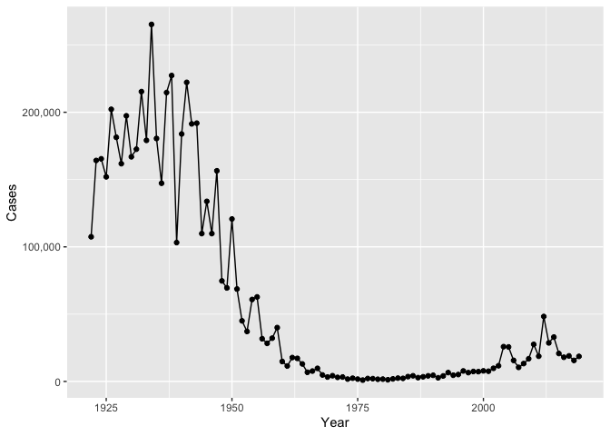
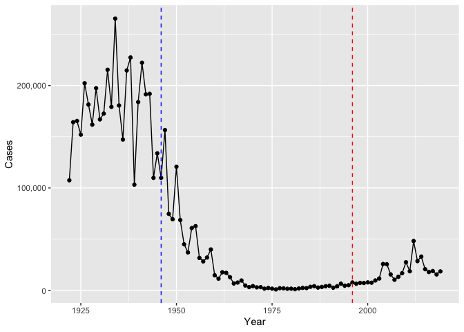
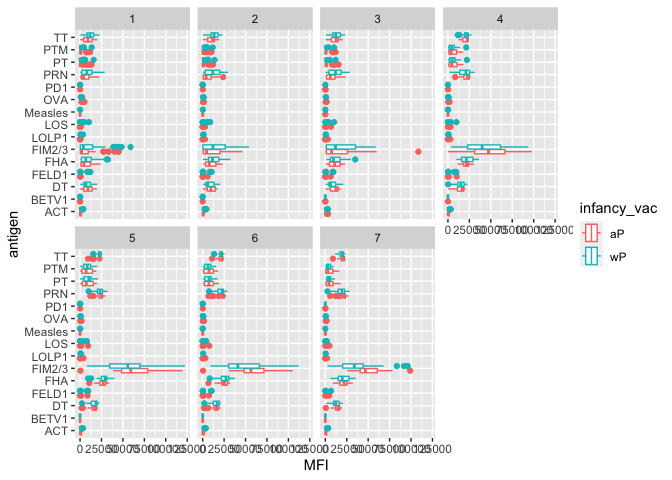
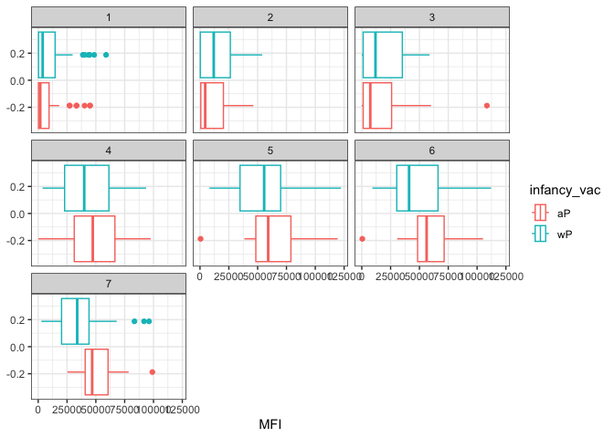
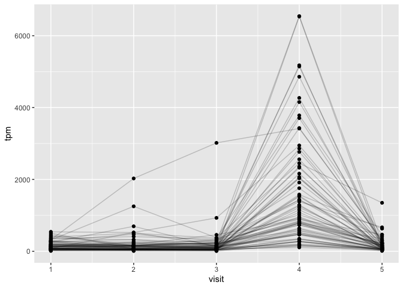

lab18
================

``` r
library(ggplot2)
base <- ggplot(cdc) +
  aes(Year,Cases) +
  geom_point() +
  geom_line() +
  scale_y_continuous(labels = scales::label_comma())
base
```



``` r
base + geom_vline(xintercept=1946, col="blue", linetype=2) + 
  geom_vline(xintercept=1996, col="red", linetype=2)
```



``` r
library(jsonlite)
subject <- read_json("http://cmi-pb.org/api/subject",simplifyVector = T)
```

``` r
table(subject$race, subject$biological_sex)
```

                                               
                                                Female Male
      American Indian/Alaska Native                  0    1
      Asian                                         18    9
      Black or African American                      2    0
      More Than One Race                             8    2
      Native Hawaiian or Other Pacific Islander      1    1
      Unknown or Not Reported                       10    4
      White                                         27   13

``` r
specimen <- read_json("http://cmi-pb.org/api/specimen",simplifyVector = T)
dim(specimen)
```

    [1] 729   6

``` r
library(dplyr)
```


    Attaching package: 'dplyr'

    The following objects are masked from 'package:stats':

        filter, lag

    The following objects are masked from 'package:base':

        intersect, setdiff, setequal, union

``` r
meta <- inner_join(specimen,subject)
```

    Joining with `by = join_by(subject_id)`

``` r
dim(subject)
```

    [1] 96  8

``` r
dim(meta)
```

    [1] 729  13

``` r
titer <- read_json("http://cmi-pb.org/api/ab_titer",simplifyVector = T)
table(titer$isotype)
```


     IgE  IgG IgG1 IgG2 IgG3 IgG4 
    6698 1413 6141 6141 6141 6141 

``` r
abmeta <- inner_join(titer,meta)
```

    Joining with `by = join_by(specimen_id)`

``` r
head(abmeta)
```

      specimen_id isotype is_antigen_specific antigen        MFI MFI_normalised
    1           1     IgE               FALSE   Total 1110.21154       2.493425
    2           1     IgE               FALSE   Total 2708.91616       2.493425
    3           1     IgG                TRUE      PT   68.56614       3.736992
    4           1     IgG                TRUE     PRN  332.12718       2.602350
    5           1     IgG                TRUE     FHA 1887.12263      34.050956
    6           1     IgE                TRUE     ACT    0.10000       1.000000
       unit lower_limit_of_detection subject_id actual_day_relative_to_boost
    1 UG/ML                 2.096133          1                           -3
    2 IU/ML                29.170000          1                           -3
    3 IU/ML                 0.530000          1                           -3
    4 IU/ML                 6.205949          1                           -3
    5 IU/ML                 4.679535          1                           -3
    6 IU/ML                 2.816431          1                           -3
      planned_day_relative_to_boost specimen_type visit infancy_vac biological_sex
    1                             0         Blood     1          wP         Female
    2                             0         Blood     1          wP         Female
    3                             0         Blood     1          wP         Female
    4                             0         Blood     1          wP         Female
    5                             0         Blood     1          wP         Female
    6                             0         Blood     1          wP         Female
                   ethnicity  race year_of_birth date_of_boost      dataset
    1 Not Hispanic or Latino White    1986-01-01    2016-09-12 2020_dataset
    2 Not Hispanic or Latino White    1986-01-01    2016-09-12 2020_dataset
    3 Not Hispanic or Latino White    1986-01-01    2016-09-12 2020_dataset
    4 Not Hispanic or Latino White    1986-01-01    2016-09-12 2020_dataset
    5 Not Hispanic or Latino White    1986-01-01    2016-09-12 2020_dataset
    6 Not Hispanic or Latino White    1986-01-01    2016-09-12 2020_dataset

``` r
table(abmeta$visit)
```


       1    2    3    4    5    6    7    8 
    5795 4640 4640 4640 4640 4320 3920   80 

``` r
ig1 <- filter(abmeta, isotype == "IgG1", visit!=8)
table(ig1$antigen)
```


        ACT   BETV1      DT   FELD1     FHA  FIM2/3   LOLP1     LOS Measles     OVA 
        393     393     426     393     426     426     393     393     393     426 
        PD1     PRN      PT     PTM      TT 
        393     426     426     393     426 

``` r
ggplot(ig1) +
  aes(MFI, antigen, col=infancy_vac) +
  geom_boxplot() + 
  facet_wrap(vars(visit), nrow=2)
```



``` r
ggplot(filter(ig1, antigen=="FIM2/3")) +
aes(MFI, col=infancy_vac) +
geom_boxplot() +
facet_wrap(vars(visit)) +
theme_bw()
```



``` r
url <- "https://www.cmi-pb.org/api/v2/rnaseq?versioned_ensembl_gene_id=eq.ENSG00000211896.7"

rna <- read_json(url, simplifyVector = TRUE) 
```

``` r
ssrna <- inner_join(rna,meta)
```

    Joining with `by = join_by(specimen_id)`

``` r
ggplot(ssrna) +
  aes(visit, tpm, group=subject_id) +
  geom_point() +
  geom_line(alpha=0.2)
```


